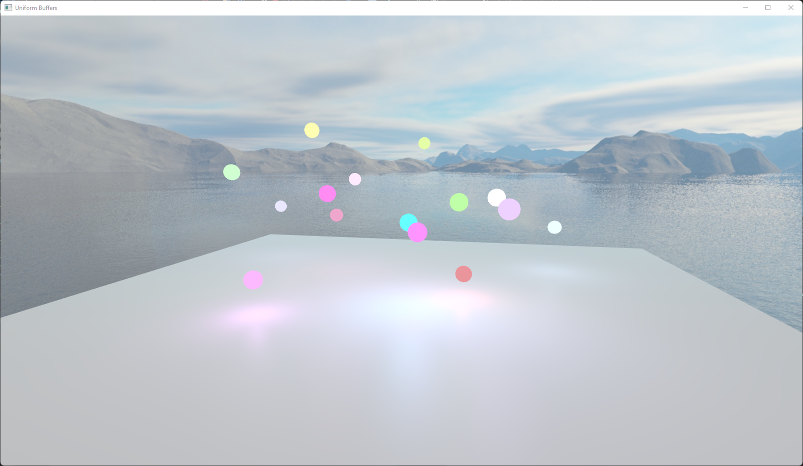
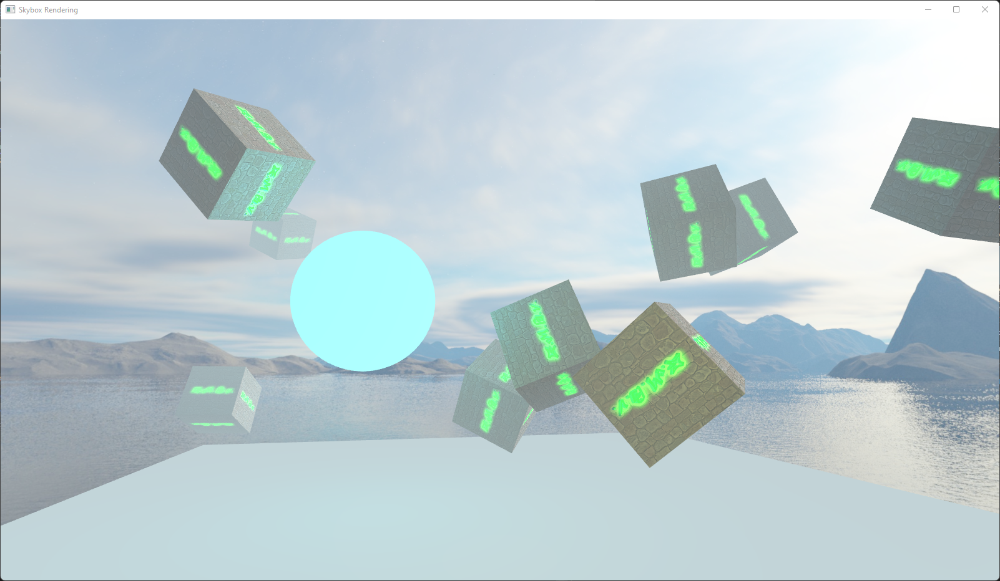
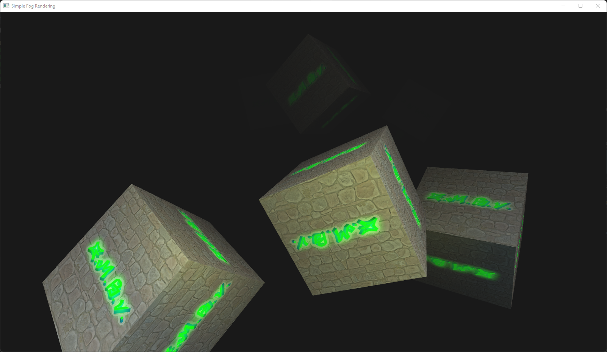
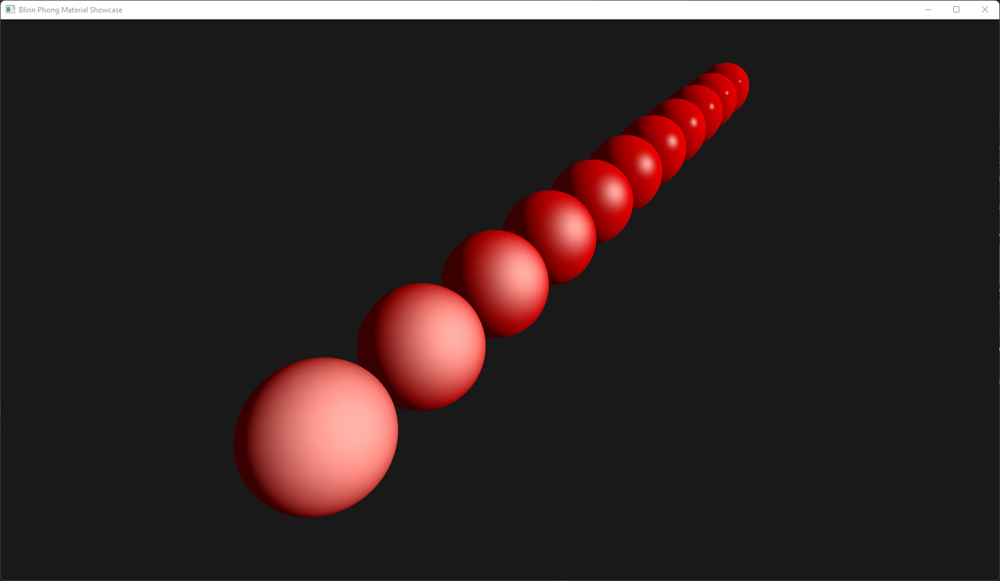
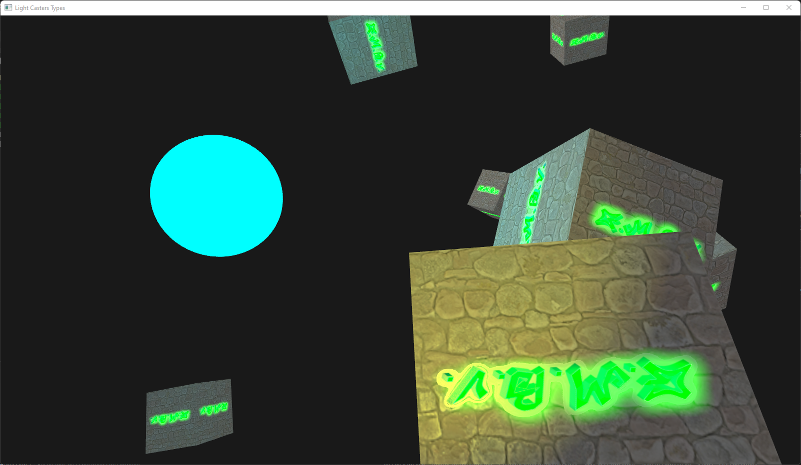
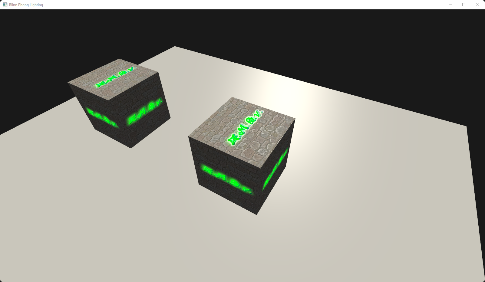

# Luminx
Luminx is a basic OpenGL application set for testing and exploring various lighting effects.

## The idea
Luminx is a useful tool for those interested in the world of lighting effects. As a basic framework, it provides users with the opportunity to experiment and test different lighting techniques in a controlled environment using OpenGL as the graphics API. This allows for a better understanding of how different lighting effects work without having to deal with a verbose API and focus on the impact of lighting algorithms on the overall visual aesthetics of a scene.

As mentioned earlier, Luminx framework focuses on exploring shading techniques, so neither the best performance nor the best scene abstraction should be expected in these applications.

## Applications
The applications are organized as follows within the Luminx workspace:
- **Basic**: These are fairly simple applications with the objective of getting in touch with the Luminx framework.
- **Lighting**: In these applications, lighting techniques are tested using Phong materials as the base shading model.
- **Camera**: Here we test different effects that have to do with camera properties *(To Be Done)*.
- **Screen Space**: Applications in this group test different lighting effects that use information from the screen *(To Be Done)*.
- **PBR**: Physically Based Rendering applications explore different physical aspects of lighting that can be implemented in real-time applications *(To Be Done)*.
- **NPR**: Non-Photorealistic Rendering applications explore different realtime rendering techniques to implement artistic styles based on drawing and illustration *(To Be Done)*.

## Screenshots

## Requirements
- OS: [Windows](https://www.microsoft.com/es-es/windows) (Luminx has been tested only on Windows at the moment)
- [Visual Studio 2022](https://visualstudio.com) (not strictly required, however included setup scripts at the moment only support this)

## Basic setup
Once you've cloned this repository using the command:

	git clone --recursive https://github.com/Frollo24/Luminx

Run `Scripts/SetupVS2022.bat` if you're using Visual Studio 2022 to generate correct Visual Studio solution and project files.